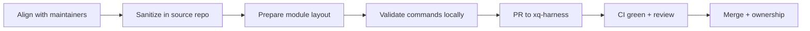

# Onboarding a module from another repository

Use this guide when a codebase lives in a **separate GitHub repository** and you
want it to become a module under `modules/<name>/` in
[xq-harness](https://github.com/chauhaidang/xq-harness).

**Do the sanitization work in your source repo first.** Do not open a PR with a
raw copy-paste of an internal tree. Maintainers will reject PRs that still carry
secrets, build artifacts, or repo-specific wiring from the old home.

---

## What “joining” means

| In your old repo | In xq-harness |
| --- | --- |
| Standalone project root | `modules/<module-name>/` only |
| Your own CI/CD workflows | Per-module workflows under `.github/workflows/` |
| Your own release process | Optional CD via shared templates (npm tarball, Swift tag, etc.) |
| Implicit conventions | `modules.yaml` is the single registry for install / build / test |

Modules are **independent**: they build and test on their own. They do not
share `node_modules` across module directories. Cross-module deps are declared
explicitly in `modules.yaml` (`depends_on`) and in package manifests (`portal:`
for sibling npm packages). CI enforces parity via `scripts/check-module-deps.js`.

See [Contributor map](./contributor-map.md), [Polyglot modules](./README.md), and
[ADR 0009](../decisions/0009-xq-toolbox-level-c-decoupling.md).

---

## Process overview



---

## Phase 0 — Align before moving code

Open an issue or thread with xq-harness maintainers **before** large migration
work. Confirm:

1. **Module name** — directory name under `modules/` (kebab-case, e.g.
   `my-service-cli`). Publishable npm packages use the `@chauhaidang/xq-harness-*`
   namespace ([ADR 0010](../decisions/0010-xq-harness-package-rename.md)).
2. **Language & toolchain** — Node (Yarn 4), Python (uv), iOS (Xcode + optional
   XcodeGen), SwiftPM, etc.
3. **Publish intent** — library published to GitHub Packages, private app module,
   or internal-only (no CD).
4. **Dependencies on other xq-harness modules** — e.g. `portal:../xq-common-kit`.
5. **CI cost** — iOS/macOS jobs need macOS runners; Playwright modules need
   browser setup or skip flags.

Agreeing up front avoids rework on naming, licensing, or scope.

---

## Phase 1 — Sanitize in your source repo (required)

Complete this checklist **in the repository you are leaving**, on a dedicated
migration branch, **before** copying files into xq-harness.

### 1.1 Secrets and credentials

Remove or replace every secret. Assume anything ever committed may still exist
in git history.

| Remove / fix | Examples |
| --- | --- |
| Environment files with real values | `.env`, `.env.local`, `*.pem`, `*.p12`, `GoogleService-Info.plist` with prod keys |
| Hard-coded tokens | API keys, PATs, `ghp_…`, `sk-…`, AWS keys, database passwords |
| Auth in config | Literal tokens in `.npmrc`, `.yarnrc.yml`, `gradle.properties`, Xcode build settings |
| CI secrets references | `${{ secrets.* }}` is fine in **new** xq-harness workflows; do not copy old secret **values** |
| Test fixtures | Real emails, phone numbers, customer IDs, production URLs |

**Use env vars and placeholders** in docs and config templates:

```ini
# .npmrc.example — commit this, not .npmrc with a real token
@chauhaidang:registry=https://npm.pkg.github.com
//npm.pkg.github.com/:_authToken=${NODE_AUTH_TOKEN}
```

For Node modules, start from the shared template
[`modules/yarnrc.github-packages.yml`](../../modules/yarnrc.github-packages.yml)
and copy it to your module as `.yarnrc.yml` with `${NODE_AUTH_TOKEN}` — never a
literal token.

If secrets were committed in the past, either:

- Export a **fresh file tree** (no `.git` from the old repo), or
- Run [git filter-repo](https://github.com/newren/git-filter-repo) / BFG and
  verify with secret scanning **before** opening the xq-harness PR.

### 1.2 Files and directories to delete

Do not copy these into xq-harness:

```text
# Dependencies & caches
node_modules/
.pnp.*
.venv/
__pycache__/
.pytest_cache/
dist/
build/
coverage/
.gradle/
DerivedData/
*.xcuserstate
**/xcuserdata/

# Local & IDE
.idea/
.DS_Store
*.log
.env
.env.*
!.env.example

# Old repo infrastructure (recreated in xq-harness if needed)
.github/          # from source repo — xq-harness uses its own workflows
.git/             # never nest a repo inside modules/
Dockerfile*       # only if agreed; prefer module-local paths
docker-compose*   # same

# Accidental large artifacts
*.zip
*.tar.gz
screenshots/
playwright-report/
test-results/
```

### 1.3 Paths and environment assumptions

Search and fix **before** copy:

| Pattern | Action |
| --- | --- |
| Absolute paths (`/Users/…`, `C:\…`) | Replace with repo-relative paths or env vars |
| Old org URLs (`github.com/old-org/…`) | Update to xq-harness paths or remove |
| Internal hostnames | Replace with placeholders or `.example` domains |
| `file:` / local-only deps | Convert to `portal:` siblings or published semver |
| Duplicate lockfiles at wrong level | One lockfile per module directory |

### 1.4 License and third-party compliance

- Ensure the module license is compatible with the xq-harness repo (and any
  vendored code is attributed).
- Remove proprietary assets you cannot redistribute (fonts, icons, licensed SDKs,
  customer-specific configs).
- List notable third-party deps in the module `README.md`.

### 1.5 Automated scans (run in source repo)

From your repo root (adjust paths):

```bash
# Obvious secret patterns (review every hit manually)
rg -i '(api[_-]?key|secret|password|token|private[_-]?key|ghp_[a-zA-Z0-9]{20,})' \
  --glob '!node_modules' --glob '!.git' --glob '!*.lock'

# Env files that should not ship
find . -name '.env*' ! -name '.env.example'

# Large files that should not be in git
find . -type f -size +1M ! -path './.git/*'

# Optional: secret scanner (install if available)
# gitleaks detect --source . --verbose
# trufflehog filesystem .
```

Every finding must be **resolved or explicitly documented** (e.g. fake test
doubles only) before migration.

### 1.6 Sanitization sign-off

Copy this into your migration PR description (source repo or xq-harness):

```markdown
## Sanitization sign-off

- [ ] No `.env` or credential files in the tree
- [ ] No hard-coded tokens or production URLs in source or tests
- [ ] No `node_modules`, build output, or IDE user data
- [ ] No nested `.git` or copied `.github/workflows` from the old repo
- [ ] Secret scan reviewed (rg / gitleaks / trufflehog)
- [ ] License and third-party assets cleared for redistribution
- [ ] Module README describes purpose, commands, and env vars
```

---

## Phase 2 — Prepare the module layout

### 2.1 Target directory

All module source lives here:

```text
modules/<module-name>/
  README.md              # required — how to install, build, test, env vars
  package.json | pyproject.toml | project.yml | Package.swift | ...
  <lockfile>             # yarn.lock, uv.lock, etc.
  src/ or App/           # language-typical layout
  tests/ or *Tests/
```

Do **not** place module code at the xq-harness repo root.

### 2.2 Naming

| Item | Convention |
| --- | --- |
| Module directory | `kebab-case`, stable short name, e.g. `harness-state` |
| npm package (if published) | `@chauhaidang/xq-harness-<short-name>` |
| npm `repository.directory` | `modules/<module-name>` |
| iOS bundle ID | Your team’s reverse-DNS; avoid `com.example` in production modules |

Do not publish under legacy `@chauhaidang/xq-*` names without `harness-`
([ADR 0010](../decisions/0010-xq-harness-package-rename.md)).

### 2.3 Lockfiles and toolchains

| Language | Lockfile | Install command (typical) |
| --- | --- | --- |
| Node | `yarn.lock` + vendored Yarn in `.yarn/releases/` | `yarn install --immutable` |
| Python | `uv.lock` | `uv sync --locked` or `uv sync --dev` |
| iOS | Xcode project + optional `project.yml` for XcodeGen | `true` or `xcodegen generate` |
| SwiftPM | `Package.resolved` | `swift package resolve` |

Pin versions in `modules.yaml` `toolchain` for documentation; CI reads module
commands from the registry, not duplicated in Makefiles.

### 2.4 Commands your module must support

xq-harness expects three commands per module (defined in `modules.yaml`):

| Action | Purpose |
| --- | --- |
| `install` | Fetch deps / prepare toolchain |
| `build` | Produce artifacts (or no-op if N/A) |
| `test` | Run automated tests; exit non-zero on failure |

Commands run with `modules/<module-name>/` as the working directory. Keep them
**non-interactive** and suitable for CI.

Example registry entry (Node):

```yaml
  my-module:
    path: modules/my-module
    language: node
    version: 0.1.0
    test_all: true          # false = skip in `make test-all`
    toolchain:
      node: ">=18"
      yarn: "4.13"
    commands:
      install: yarn install --immutable
      build: yarn build
      test: yarn test
```

Example (Python):

```yaml
  my-cli:
    path: modules/my-cli
    language: python
    version: 0.1.0
    test_all: false
    toolchain:
      python: "3.12"
      uv: required
    commands:
      install: uv sync --locked
      build: uv build
      test: uv run pytest
```

Example (iOS):

```yaml
  my-ios-app:
    path: modules/my-ios-app
    language: ios
    version: 0.1.0
    test_all: false
    toolchain:
      xcode: "16"
      xcodegen: required
    commands:
      install: "true"
      build: >
        xcodebuild -project my-ios-app.xcodeproj
        -scheme my-ios-app
        -destination 'platform=iOS Simulator,name=iPhone 16'
        build
      test: >
        xcodebuild -project my-ios-app.xcodeproj
        -scheme my-ios-app
        -destination 'platform=iOS Simulator,name=iPhone 16'
        test
```

If the module depends on another registry module, declare both `depends_on` and
a matching `portal:../<sibling>` in `package.json`, then run
`node scripts/check-module-deps.js`.

```yaml
    depends_on:
      - xq-common-kit
```

---

## Phase 3 — Validate locally (before opening PR)

### 3.1 Dry run in a clean tree

1. Copy the sanitized module into a local clone of xq-harness (or use your PR branch).
2. Add the `modules.yaml` entry.
3. From repo root:

```bash
./scripts/module ci <module-name>
node scripts/check-module-deps.js   # when package.json has portal: siblings
```

Requires [yq](https://github.com/mikefarah/yq). Fix failures before requesting
review.

### 3.2 README minimum

Module `README.md` should include:

- One-paragraph purpose
- Prerequisites (Node version, Xcode, etc.)
- Commands (`./scripts/module ci <name>` from repo root)
- Required env vars (names only, no values)
- Publish/consume notes if applicable

---

## Phase 4 — Open the xq-harness PR

### 4.1 PR contents

| Include | Do not include |
| --- | --- |
| `modules/<name>/` sanitized source | Old repo `.github/workflows` |
| `modules.yaml` entry | Secrets or `.env` files |
| `ci-<module>.yml` (and `cd-` if publishable) | Unrelated monorepo refactors |
| `.github/CODEOWNERS` lines for your team | `node_modules` or build artifacts |
| Optional `docs/product/<name>.md` | Entire old repo history as nested git |

Keep PRs focused: **one module per PR** when possible.

### 4.2 CI/CD wiring

Follow [GitHub Actions — modular CI/CD](../github-actions.md):

1. Copy an existing caller workflow (e.g. `ci-xq-common-kit.yml`).
2. Rename to `ci-<module>.yml` / `cd-<module>.yml`.
3. Set `paths` to your module directory + shared bootstrap files.
4. For npm publish: add module to `scripts/check-xq-version-changes.js`
   `publishPrefixes`.
5. For CD, verify workflow permissions against the existing CD caller patterns in
   this repo before opening the PR.

Workflows must call `./scripts/module ci <module>` — do not duplicate install/build/test commands in YAML.

### 4.3 Ownership

Add CODEOWNERS entries for:

- `/.github/workflows/ci-<module>.yml`
- `/.github/workflows/cd-<module>.yml` (if any)
- `/modules/<module>/`

Use a GitHub team handle (e.g. `@chauhaidang/my-team`) so reviews route correctly.

---

## Phase 5 — Maintainer review (what we check)

Reviewers use this list; prepare your PR so each item is easy to verify.

- [ ] Sanitization sign-off present and credible
- [ ] `modules.yaml` entry complete; version matches native project file
- [ ] `./scripts/module ci <module>` passes locally and in CI
- [ ] No secrets, env files, or large binaries
- [ ] Lockfile committed; install is reproducible
- [ ] README documents env vars and scope
- [ ] Path filters and CODEOWNERS updated
- [ ] Publish naming follows ADR 0010 if npm package
- [ ] `test_all` set intentionally (default in runner is `true` if omitted — set `false` for heavy or optional modules)

---

## Language-specific notes

### Node / TypeScript

- Use Yarn 4 with `nodeLinker: node-modules` (see existing modules).
- Shared TS config: extend [`modules/tsconfig.base.json`](../../modules/tsconfig.base.json) when applicable.
- Sibling deps: `"@chauhaidang/xq-harness-common-kit": "portal:../xq-common-kit"`.
- Commit `.yarn/releases/yarn-*.cjs` with `.yarnrc.yml`.

### Python

- Use `uv` with `pyproject.toml` + `uv.lock`.
- Keep package import path under `src/` consistent with pytest config.
- Do not commit `.venv/`.
- If the module needs BasedPyright, start from
  [`docs/templates/python-basedpyright-module`](../templates/python-basedpyright-module/)
  and wire `modules.yaml` to `uv sync --locked`,
  `uv run basedpyright && uv build`, and `uv run pytest`.

### iOS / SwiftUI

- Prefer `project.yml` + XcodeGen; commit generated `.xcodeproj`.
- Ignore local build dirs (`DerivedData`, `build/` — see root `.gitignore`).
- Document simulator destination if not iPhone 16.
- macOS CI required for build/test workflows.

### SwiftPM libraries

- See `xq-ios-ui-test-framework` for Package.swift + dedicated CI/CD patterns
  (tag-driven subtree release).

---

## Common rejection reasons

| Reason | Fix |
| --- | --- |
| `.env` or API key in diff | Remove, rotate credential, rescan |
| Copied old `.github/workflows` | Delete; use xq-harness templates |
| `node_modules` or `DerivedData` committed | Delete, fix `.gitignore`, recommit |
| Commands only documented in README | Add `modules.yaml` commands; CI uses registry |
| Wrong npm scope / legacy package name | Rename per ADR 0010 |
| Module at repo root | Move under `modules/<name>/` |
| Non-reproducible install | Commit lockfile; use `--immutable` / `--locked` |

---

## Reference

| Topic | Doc |
| --- | --- |
| Module registry & runner | [docs/modules/README.md](./README.md) |
| CI/CD templates | [docs/github-actions.md](../github-actions.md) |
| Package naming | [ADR 0010](../decisions/0010-xq-harness-package-rename.md) |
| Polyglot layout decision | [ADR 0008](../decisions/0008-polyglot-monorepo-modules.md) |
| Consumer packages | [CATALOGUE.md](../../CATALOGUE.md) |

Questions or proposed module names: open an issue in xq-harness before large migrations.
