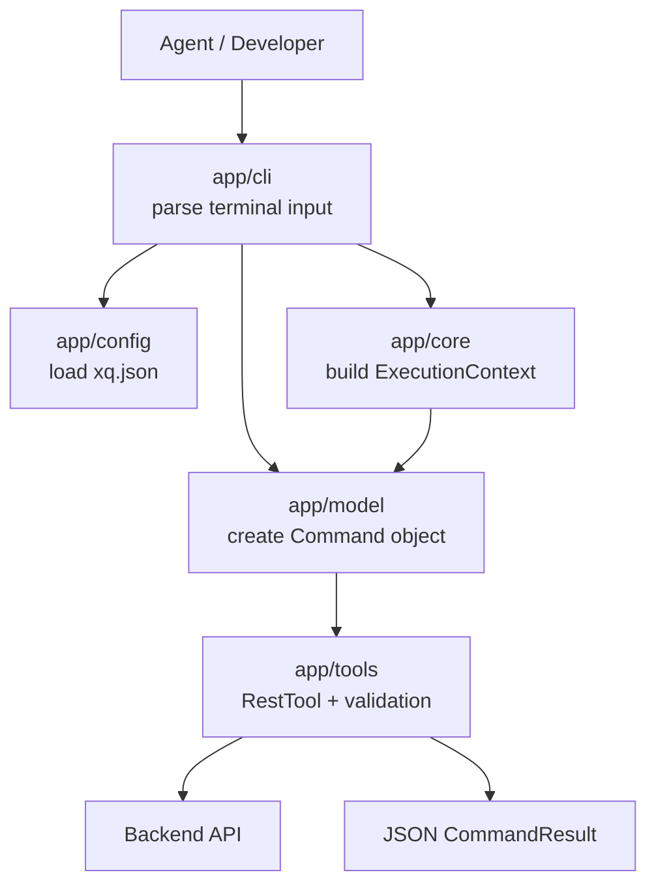

# Track 1 Day 1 Developer Guide: Build xq-octopus

This guide is written for a junior developer who is new to modern Node.js and
TypeScript CLI development. Follow it in order. Do not jump directly into the
CLI command handlers; build the small typed objects first, then connect them
through the engine, then expose them through Commander.

## Goal

Build `xq-octopus`, a small Node.js CLI for backend REST API testing.

The CLI should let an agent or developer run commands like:

```bash
xq-octopus get /health --env dev --expect-status 200
xq-octopus post /users --env dev --body '{"name":"Ada"}' --expect-status 201
```

The CLI only does four things:

1. Load API test configuration from `xq.json`.
2. Call REST APIs.
3. Validate responses.
4. Print JSON evidence.

Do not build scenario parsing, MCP tools, OpenAPI loading, API catalog loading,
or domain reasoning. The agent decides which CLI command to call.

Day 1 must also establish the CLI-as-skill surface. The tool must explain itself
well enough that an agent can discover commands, decide which command to call,
and parse the result without reading source code.

## Chosen Stack

Use the same general stack as the existing Node modules in this harness repo:

- Node.js `>=22`
- npm `11`
- TypeScript
- Commander for CLI command routing
- Built-in `node:test` for tests
- ESLint for linting
- Built-in Node `fetch` and `AbortController` for HTTP

Do not use Python, `uv`, Typer, Rich, pytest, or basedpyright for this module.

## Mental Model

Think of the codebase as a pipeline:



Keep this separation clear:

- CLI code translates terminal flags into TypeScript objects.
- Model code defines interfaces, classes, and result shapes.
- Core code coordinates execution and catches unexpected errors.
- Tool code performs capabilities such as REST calls and validation.
- Output code serializes results for humans or agents.

## Beginner TypeScript Rules

Follow these rules throughout the module:

- Use explicit types on exported functions, classes, and interfaces.
- Prefer `interface` for contracts and `type` for unions or structured aliases.
- Use `readonly` fields when a value should not change after construction.
- Keep functions small. A good first target is one job per function.
- Do not print from deep modules. Only `app/cli` should print.
- Do not read files from deep modules except the config loader.
- Do not catch broad errors except when converting them into a structured
  `CommandResult` at the engine boundary.
- Never print `apiToken`.
- Return plain JSON-serializable objects from internals, then stringify at the
  CLI edge.

## CLI-as-Skill Requirement

`xq-octopus` must be self-describing:

- `xq-octopus --help` explains the tool purpose, command list, config model,
  JSON output model, and exit codes.
- `xq-octopus <command> --help` explains command intent, required inputs,
  examples, output shape, and exit codes.
- `xq-octopus commands --json` emits a stable machine-readable command catalog.

This is separate from scenario reasoning. The CLI tells agents what tools exist;
the agent still decides which tool matches a user scenario.

## Step 0: Prepare the Local Environment

Work from inside this module:

```bash
cd modules/xq-octopus
```

Check the required tools:

```bash
node --version
npm --version
```

Expected:

- Node.js is `22` or newer.
- npm is `11.x` or close to the repo pin.

If `npm --version` is missing, fix the Node/npm installation before continuing.

Do not install global npm packages for this module. Keep dependencies in
`package.json` and install them with npm inside `modules/xq-octopus`.

Use this implementation order:

1. Create package/config files.
2. Make a minimal CLI compile.
3. Add model types.
4. Add config loading.
5. Add validation.
6. Add `RestTool`.
7. Add `ToolFactory`.
8. Add `ExecutionEngine`.
9. Wire Commander commands.
10. Add catalog JSON.
11. Add tests and validate.

## Step 1: Project Setup From an Empty Module

This step turns `modules/xq-octopus` from a documentation-only folder into a
real Node.js project. Do this before implementing config loading, REST calls, or
tests.

Start inside the module:

```bash
cd modules/xq-octopus
```

At the beginning, it is valid for the folder to contain only:

```text
HANDOFF.md
xq-octopus-dev-guide.md
```

Create the source and test folders:

```bash
mkdir -p app/config app/cli app/core app/model app/tools test
```

Create the project metadata files:

```bash
touch README.md package.json tsconfig.json .eslintrc.cjs .prettierrc.json .prettierignore xq.json.example
```

Create the source files:

```bash
touch app/config/loader.ts
touch app/cli/main.ts app/cli/output.ts
touch app/core/engine.ts
touch app/model/config.ts app/model/command.ts app/model/result.ts
touch app/tools/factory.ts app/tools/rest-tool.ts app/tools/validation.ts app/tools/catalog.ts
```

Create the test files:

```bash
touch test/config.test.ts test/engine.test.ts test/tool-factory.test.ts test/rest-tool.test.ts
touch test/catalog.test.ts test/output.test.ts test/validation.test.ts test/cli.test.ts
```

Now fill in these files from the templates in this guide:

1. `package.json`
2. `tsconfig.json`
3. `.eslintrc.cjs`
4. `.prettierrc.json`
5. `.prettierignore`
6. `app/cli/main.ts`
7. `xq.json.example`
8. `README.md`

Then install dependencies:

```bash
npm install --include=dev
```

Use a module-local `package-lock.json` and keep validation reproducible with:

```bash
npm ci --include=dev
```

Build the starter CLI:

```bash
npm run build
```

Run the compiled starter CLI:

```bash
node dist/cli/main.js --help
```

Expected result:

- The command exits successfully.
- It prints Commander help for `xq-octopus`.
- The `dist/` folder exists.
- No REST/API behavior is implemented yet.

Before running tests, create at least one starter test so `node:test` proves it
is wired correctly:

```ts
import assert from "node:assert/strict"
import test from "node:test"

test("project setup runs tests", () => {
  assert.equal(true, true)
})
```

Put that test in `test/setup.test.ts` or one of the existing test files. Then
run:

```bash
npm test
```

Project setup is done only when these commands work from inside
`modules/xq-octopus`:

```bash
npm ci --include=dev
npm run build
npm test
node dist/cli/main.js --help
```

Do not start implementing `RestTool`, `ExecutionEngine`, or config loading until
this setup checkpoint passes.

## Step 2: Create the Module Skeleton

Create exactly this structure:

```text
modules/xq-octopus/
  README.md
  package.json
  tsconfig.json
  .eslintrc.cjs
  .prettierrc.json
  .prettierignore
  xq.json.example
  app/
    config/
      loader.ts
    cli/
      main.ts
      output.ts
    core/
      engine.ts
    model/
      config.ts
      command.ts
      result.ts
    tools/
      factory.ts
      rest-tool.ts
      validation.ts
      catalog.ts
  test/
    config.test.ts
    engine.test.ts
    tool-factory.test.ts
    rest-tool.test.ts
    catalog.test.ts
    output.test.ts
    validation.test.ts
    cli.test.ts
```

This guide is module-local. Run commands while standing inside
`modules/xq-octopus`. Do not depend on commands outside this module while
building it.

If a file already exists, open it and reconcile it with this guide instead of
creating a second version with a similar name.

Shape rule:

- `app/cli` is the thin Commander adapter and output renderer.
- `app/core` coordinates config, tool access, and result normalization.
- `app/config` owns `xq.json` loading and validation.
- `app/model` owns shared typed data structures.
- `app/tools/factory.ts` creates and caches tools for command execution.
- `app/tools/rest-tool.ts` owns REST execution and REST validation workflow.
- `app/tools/validation.ts` owns status and JSON-pointer checks.
- `app/tools/catalog.ts` owns the `commands --json` command catalog data.
- `test/` contains module-local tests.

Do not make CLI command functions call `fetch` or validation helpers directly.
They should build a command model and call the engine.

## Step 3: Configure the Node Package

Create `package.json` first. This file tells Node/npm how to install,
build, test, and expose the CLI command.

Use this as the starting shape:

```json
{
  "name": "xq-octopus",
  "version": "0.1.0",
  "type": "module",
  "description": "Agent-friendly REST API testing CLI",
  "main": "dist/cli/main.js",
  "types": "dist/cli/main.d.ts",
  "bin": {
    "xq-octopus": "./dist/cli/main.js"
  },
  "files": ["dist", "README.md", "skills"],
  "scripts": {
    "build": "tsc",
    "test": "node --test test/**/*.test.ts",
    "lint": "eslint . --ext .ts",
    "format": "prettier --write .",
    "format:check": "prettier --check .",
    "clean": "rm -rf dist"
  },
  "packageManager": "npm@11.16.0",
  "engines": {
    "node": ">=22.0.0"
  },
  "keywords": ["xq", "cli", "api-testing", "rest"],
  "license": "Apache-2.0",
  "dependencies": {
    "commander": "14.0.0"
  },
  "devDependencies": {
    "@types/node": "^24.13.2",
    "@typescript-eslint/eslint-plugin": "^8.0.0",
    "@typescript-eslint/parser": "^8.0.0",
    "eslint": "^8.50.0",
    "prettier": "^3.9.4",
    "typescript": "^5.9.3"
  }
}
```

What the important fields mean:

- `bin.xq-octopus` is what makes the `xq-octopus` command available after the
  package is linked or installed.
- `files` includes `skills` so the agent skill ships with the `xq-octopus`
  release package.
- `main` points to the compiled JavaScript entry file.
- `types` points to generated TypeScript declaration output.
- `scripts.build` runs the TypeScript compiler.
- `scripts.test` runs Node's built-in test runner against TypeScript test files.
- `scripts.format` and `scripts.format:check` run Prettier for module-local
  formatting.
- `packageManager` and `engines` keep the module aligned with the harness repo.

Create `tsconfig.json` next:

```json
{
  "compilerOptions": {
    "target": "ES2022",
    "module": "nodenext",
    "moduleResolution": "nodenext",
    "rootDir": "app",
    "outDir": "dist",
    "declaration": true,
    "strict": true,
    "esModuleInterop": true,
    "forceConsistentCasingInFileNames": true,
    "skipLibCheck": true,
    "types": ["node"]
  },
  "include": ["app/**/*.ts"],
  "exclude": ["dist", "node_modules", "test"]
}
```

Why this setup:

- `rootDir: "app"` means source files live under `app/`.
- `outDir: "dist"` means compiled files go to `dist/`.
- `declaration: true` generates `.d.ts` files.
- `module: "nodenext"` matches the package's ESM setup and Node's module
  resolution behavior.
- `strict: true` makes TypeScript catch beginner mistakes early.

Optional but recommended: create `.eslintrc.cjs`:

```js
module.exports = {
  parser: "@typescript-eslint/parser",
  plugins: ["@typescript-eslint"],
  extends: ["eslint:recommended", "plugin:@typescript-eslint/recommended"],
  env: {
    node: true,
    es2022: true
  }
}
```

Create `.prettierrc.json`:

```json
{
  "printWidth": 100,
  "semi": false,
  "singleQuote": false,
  "trailingComma": "none"
}
```

Create `.prettierignore`:

```text
dist
node_modules
coverage
```

Create the CLI entry file early, even if it only shows help at first:

```ts
#!/usr/bin/env node

import { Command } from "commander"

export function buildCli(): Command {
  const program = new Command()

  program
    .name("xq-octopus")
    .description("Agent-friendly REST API testing CLI")
    .version("0.1.0")

  return program
}

export function main(argv: string[] = process.argv): void {
  buildCli().parse(argv)
}

main()
```

After the files exist, run these module-local setup commands:

```bash
npm install --include=dev
npm run build
npm test
npm run format:check
npm run lint
```

Use `npm ci --include=dev` for reproducible validation.

Do not move on until `npm run build` can compile the starter CLI. Once the
starter test exists, `npm test`, `npm run format:check`, and `npm run lint`
must also pass.

## Step 4: Define `xq.json`

Support this config shape:

```json
{
  "environments": {
    "dev": {
      "apiBaseUrl": "https://api.example.test",
      "apiToken": null,
      "headers": {
        "X-App": "local"
      }
    }
  }
}
```

Rules:

- Default config path is `./xq.json`.
- `--config path/to/xq.json` overrides the default path.
- `--env` is required.
- The selected environment must exist.
- `apiBaseUrl` is required and cannot be blank.
- `apiToken` is optional.
- `headers` is optional.
- Header keys and values must be strings.
- Never print `apiToken`.

Create `xq.json.example` with safe fake values only.

Use this initial `xq.json.example`:

```json
{
  "environments": {
    "dev": {
      "apiBaseUrl": "https://api.example.test",
      "apiToken": null,
      "headers": {
        "X-App": "local"
      }
    }
  }
}
```

Also create a small `README.md` early so a developer can run the module without
opening source files:

````md
# xq-octopus

Agent-friendly REST API testing CLI.

## Local commands

```bash
npm ci --include=dev
npm run build
npm test
npm run format:check
npm run lint
node dist/cli/main.js --help
```

## Config

Copy `xq.json.example` to `xq.json` and choose an environment with `--env`.
````

## Step 5: Define Shared Models

In `app/model/`, define the data structures that make the deep interface clear:

- `RuntimeConfig`
- `Command`
- `RestCommand`
- `ExecutionContext`
- `HttpResponseEvidence`
- `ValidationCheck`
- `ValidationResult`
- `CommandResult`
- typed error result objects

Keep these models small and JSON-serializable. They should not perform network
I/O, read files, or print output.

### Interfaces

Use TypeScript interfaces for contracts:

```ts
export interface RuntimeConfig {
  readonly environment: string
  readonly apiBaseUrl: string
  readonly apiToken: string | null
  readonly headers: Readonly<Record<string, string>>
}
```

Use an interface for the shared `Command` contract:

```ts
export interface Command {
  readonly kind: string
  readonly timeoutMs: number
  execute(context: ExecutionContext): Promise<CommandResult>
}
```

The primary internal interface is:

```ts
const engine = new ExecutionEngine(config, { tools: toolFactory })
const result = await engine.execute(command)
```

`Command` is the shared contract all future executable commands must satisfy.
It must include an `execute()` method that contains the actual logic of how the
command runs.

### RestCommand

`RestCommand` is the first concrete command:

```ts
export type RestMethod = "GET" | "POST" | "PUT" | "PATCH" | "DELETE"

export class RestCommand implements Command {
  readonly kind = "rest"

  constructor(
    readonly method: RestMethod,
    readonly path: string,
    readonly body: unknown,
    readonly expectedStatus: number | null,
    readonly expectedJson: readonly string[],
    readonly timeoutMs: number
  ) {}

  async execute(context: ExecutionContext): Promise<CommandResult> {
    const restTool = context.tools.rest()

    switch (this.method) {
      case "GET":
        return restTool.callGet(this, context.config)
      case "POST":
        return restTool.callPost(this, context.config)
      case "PUT":
        return restTool.callPut(this, context.config)
      case "PATCH":
        return restTool.callPatch(this, context.config)
      case "DELETE":
        return restTool.callDelete(this, context.config)
    }
  }
}
```

Do not add new engine methods such as `executeRest()` or `executeGraphql()`.
Future commands should satisfy the same `Command` contract.

### ExecutionContext

`ExecutionContext` carries shared runtime access for one command execution:

```ts
export interface ExecutionContext {
  readonly config: RuntimeConfig
  readonly tools: ToolFactory
}
```

Do not attach low-level HTTP transport directly to `ExecutionContext`. That
would make the core execution interface REST-specific. Commands should ask the
tool factory for the capability they need. `RestCommand.execute(context)` should
call `context.tools.rest()` and then choose the method-specific REST operation:
`callGet()`, `callPost()`, `callPut()`, `callPatch()`, or `callDelete()`.
`RestTool` owns the REST transport details internally.

## Step 6: Implement Runtime Config

In `app/model/config.ts`, create:

- `RuntimeConfig`
- `RedactedRuntimeConfig`
- a helper such as `redactRuntimeConfig(config)`

Redacted output shape:

```json
{
  "environment": "dev",
  "apiBaseUrl": "https://api.example.test",
  "hasApiToken": true,
  "headers": {
    "X-App": "local"
  }
}
```

Implementation notes:

- Use camelCase for config input, internal runtime config, and CLI output: `apiBaseUrl`, `apiToken`.
- Include `hasApiToken`, not the actual token.
- Keep token redaction close to the config model.

## Step 7: Implement Config Loading

In `app/config/loader.ts`, implement a function that:

1. Reads `xq.json`.
2. Parses JSON.
3. Finds `environments[env]`.
4. Validates required fields.
5. Returns `RuntimeConfig`.

Suggested function shape:

```ts
export async function loadRuntimeConfig(
  configPath: string,
  env: string
): Promise<RuntimeConfig> {
  // ...
}
```

Use `fs/promises.readFile` and `JSON.parse`.

Return or throw clear typed errors for:

- Missing config file.
- Invalid JSON.
- Missing `environments`.
- Unknown `--env`.
- Missing or blank `apiBaseUrl`.
- Non-string header keys or values.

For a junior implementer: prefer throwing a small custom `ConfigError`, then let
the CLI convert it into exit code `2`. Do not call `console.log()` from the
loader.

## Step 8: Implement Validation

In `app/tools/validation.ts`, support:

```bash
--expect-status 200
--expect-json /data/id=123
```

Rules:

- Status check compares response status code.
- JSON check uses JSON Pointer-style paths.
- Values after `=` should parse as JSON when possible:
  - `123` becomes a number.
  - `true` becomes a boolean.
  - `"abc"` becomes a string.
  - `abc` can stay a string.
- Missing JSON path is a failed check, not a crash.

Example validation output:

```json
{
  "passed": false,
  "checks": [
    {
      "type": "status",
      "expected": 200,
      "actual": 500,
      "passed": false
    }
  ]
}
```

Implementation notes:

- Keep validation pure: inputs in, `ValidationResult` out.
- Do not perform HTTP calls here.
- Do not print here.
- Unit test this before building the REST tool.

## Step 9: Implement RestTool

In `app/tools/rest-tool.ts`, implement the REST capability used by
`RestCommand.execute(context)`.

`RestTool` owns the workflow for:

1. Building a REST request from `RuntimeConfig` and `RestCommand`.
2. Calling Node's built-in `fetch`.
3. Running status and JSON-pointer validation.
4. Returning command-ready result data.

Suggested class shape:

```ts
export class RestTool {
  async callGet(
    command: RestCommand,
    config: RuntimeConfig
  ): Promise<CommandResult> {
    // ...
  }

  async callPost(
    command: RestCommand,
    config: RuntimeConfig
  ): Promise<CommandResult> {
    // ...
  }

  async callPut(
    command: RestCommand,
    config: RuntimeConfig
  ): Promise<CommandResult> {
    // ...
  }

  async callPatch(
    command: RestCommand,
    config: RuntimeConfig
  ): Promise<CommandResult> {
    // ...
  }

  async callDelete(
    command: RestCommand,
    config: RuntimeConfig
  ): Promise<CommandResult> {
    // ...
  }
}
```

Do not rely on `RestTool.execute(command, config)` as the primary public tool
interface. `RestCommand.execute(context)` should select the method-specific
operation and call it directly. This keeps the engine generic while still making
the REST tool's public operations obvious to future command authors.

REST behavior:

- Join `apiBaseUrl` and path safely with `new URL(path, baseUrl)`.
- Send JSON body from `--body` or `--body-file`.
- Add `Accept: application/json`.
- Add `Content-Type: application/json` when a body exists.
- Add `Authorization: Bearer <token>` when configured.
- Merge custom headers from `xq.json`.
- Use `AbortController` for timeout.
- Measure duration in milliseconds.
- Parse JSON response when possible.
- Keep text response when JSON parsing fails.
- Return HTTP error responses as structured evidence when the server sent a
  response.

Example evidence:

```json
{
  "method": "GET",
  "url": "https://api.example.test/health",
  "status_code": 200,
  "headers": {
    "content-type": "application/json"
  },
  "json": {
    "ok": true
  },
  "text": null,
  "duration_ms": 12
}
```

Boundary rules:

- REST transport code should not know CLI flags.
- REST transport code should not know `xq.json`.
- `app/tools/rest-tool.ts` may know `RuntimeConfig`, `RestCommand`, and
  validation rules.

## Step 10: Implement ToolFactory

In `app/tools/factory.ts`, create a small factory that owns tool construction:

```ts
export class ToolFactory {
  private restTool?: RestTool

  rest(): RestTool {
    this.restTool ??= new RestTool()
    return this.restTool
  }
}
```

Why this exists:

- Commands should ask for capabilities, not low-level transport details.
- The engine should not know how to build every tool.
- Future tools can be added without changing the engine interface.

Implementation notes:

- The factory can lazily create `RestTool` the first time `rest()` is called.
- It may cache the same `RestTool` instance for reuse.
- It should not print or parse CLI flags.

## Step 11: Implement the Engine

In `app/core/engine.ts`, coordinate one command:

1. Initialize `ExecutionEngine` with `RuntimeConfig` and optional `ToolFactory`.
2. Expose one main method: `execute(command: Command): Promise<CommandResult>`.
3. Build an `ExecutionContext` containing config and tool access.
4. Call `command.execute(context)`.
5. Normalize uncaught command errors into `CommandResult`.
6. Return a `CommandResult`.

Recommended interface:

```ts
export class ExecutionEngine {
  constructor(
    private readonly config: RuntimeConfig,
    private readonly options: { tools?: ToolFactory } = {}
  ) {}

  async execute(command: Command): Promise<CommandResult> {
    // ...
  }
}
```

The engine should not dispatch by `command.kind` for normal execution. The
command's `execute()` method owns the actual run logic. `kind` remains useful
for cataloging, logging, result metadata, and validation.

Testing guidance:

- Engine tests should cover context creation.
- Engine tests should cover delegation to `command.execute(context)`.
- Engine tests should cover uncaught error normalization.
- REST request and validation behavior belongs in `RestTool` tests, not engine
  tests.

## Step 12: Build the CLI

In `app/cli/main.ts`, use Commander.

Commands:

```bash
xq-octopus --help
xq-octopus commands --json
xq-octopus config --env dev
xq-octopus get /health --env dev --expect-status 200
xq-octopus post /users --env dev --body '{"name":"Ada"}' --expect-status 201
xq-octopus put /users/123 --env dev --body-file payload.json
xq-octopus patch /users/123 --env dev --body '{"active":true}'
xq-octopus delete /users/123 --env dev --expect-status 204
```

Shared flags:

- `--env`
- `--config`
- `--expect-status`
- `--expect-json`
- `--timeout`
- `--pretty`

CLI implementation pattern:

1. Parse options with Commander.
2. Load config with `loadRuntimeConfig()`.
3. Build a `RestCommand`.
4. Build `ExecutionEngine`.
5. Call `await engine.execute(command)`.
6. Render the result.
7. Set `process.exitCode` to the correct code.

The CLI should be thin. If a command handler grows large, move logic into
config, model, core, or tools.

Exit codes:

- `0`: request completed and validations passed.
- `1`: validation failed.
- `2`: config or input error.
- `3`: transport error.

## Step 13: Build Output Rendering

In `app/cli/output.ts`, implement:

- JSON rendering for default output.
- Pretty rendering for human-readable summaries.
- Error rendering for config/input, validation, and transport failures.

Rules:

- Default output must be valid JSON.
- Default JSON output should use `JSON.stringify`.
- Token values must never appear in output.
- Results should be plain JSON-serializable objects.

## Step 14: Build the Command Catalog

Create `app/tools/catalog.ts`.

The command catalog is the CLI-as-skill contract. It should be data, not prose
hidden in command implementations.

Each command entry should include:

- `name`
- `summary`
- `whenToUse`
- `arguments`
- `options`
- `requiredConfig`
- `outputShape`
- `exitCodes`
- `examples`

`xq-octopus commands --json` should emit all entries as JSON.

Beginner rule: define the catalog as TypeScript data first, then make the CLI
render it. Do not duplicate catalog text separately inside Commander handlers.

## Step 15: Write Tests in This Order

Start with tests before wiring the whole CLI together.

1. `config.test.ts`
   - Loads valid config.
   - Fails on missing config.
   - Fails on invalid JSON.
   - Fails on unknown environment.
   - Redacts token.

2. `validation.test.ts`
   - Status validation passes.
   - Status validation fails.
   - JSON pointer validation passes.
   - Missing JSON pointer fails cleanly.
   - JSON-looking expected values are parsed correctly.

3. `rest-tool.test.ts`
   - Builds the correct URL.
   - Exposes method-specific calls: `callGet()`, `callPost()`, `callPut()`,
     `callPatch()`, and `callDelete()`.
   - Sends token, headers, and body.
   - Parses JSON response.
   - Keeps text response when response is not JSON.
   - Handles HTTP error response as structured evidence.
   - Runs status and JSON-pointer validation through the REST workflow.

4. `engine.test.ts`
   - Builds `ExecutionContext` with config and tool access.
   - Delegates to `command.execute(context)`.
   - Does not branch on `command.kind` for normal execution.
   - Maps uncaught command failures to structured error results.
   - Does not call `RestTool` directly.

5. `tool-factory.test.ts`
   - Creates `RestTool`.
   - Reuses cached tool instances when appropriate.
   - Keeps HTTP transport construction hidden behind the tools layer.

6. `catalog.test.ts`
   - Command catalog includes every public command.
   - Each command has summary, when-to-use, examples, output shape, and exit
     codes.
   - `commands --json` shape remains stable.

7. `output.test.ts`
   - Default output is valid JSON.
   - Pretty output does not leak tokens.
   - Error output is structured.

8. `cli.test.ts`
   - `config --env dev` prints redacted JSON.
   - `get /health --env dev --expect-status 200` exits `0`.
   - Failed expected status exits `1`.
   - Missing config exits `2`.
   - `--help` includes command summaries.
   - `<command> --help` includes examples or useful option help.
   - `commands --json` returns valid command catalog JSON.

Use a local in-process HTTP server for CLI and REST tests. Do not rely on an
external backend.

Testing tips for TypeScript beginners:

- Put shared test helpers in `test/` files or a small helper module.
- Use temporary directories from Node's `fs.mkdtemp` when tests need files.
- Use `await assert.rejects(promise, /message/)` for expected async failures.
- Keep each test focused on one behavior.
- Test public functions and classes, not private helper details.

## Step 16: Validate the Module

Run these commands while standing inside `modules/xq-octopus`:

```bash
npm ci --include=dev
npm run build
npm test
npm run format:check
npm run lint
```

Done means:

- TypeScript compilation passes.
- Tests pass.
- Prettier and ESLint checks pass.
- `node dist/cli/main.js --help` shows the public commands.
- The CLI can call a local test API and return JSON output.

## Common Mistakes to Avoid

- Do not put REST logic in `app/cli/main.ts`.
- Do not make `ExecutionEngine` branch on `command.kind`.
- Do not attach low-level HTTP transport to `ExecutionContext`.
- Do not print from `app/model`, `app/core`, `app/config`, or `app/tools`.
- Do not leak `apiToken` in normal output, errors, logs, or tests.
- Do not use live external APIs in tests.
- Do not add Jest, ts-jest, or another test framework for v1; use `node:test`.
- Do not add scenario reasoning to this CLI.
- Do not reintroduce Python project files such as `pyproject.toml` or `uv.lock`.

## Out of Scope

Do not add these in v1:

- Scenario Markdown parsing.
- MCP server or MCP tools.
- OpenAPI loading.
- API catalog loading.
- Domain-specific command inference.
- Generated API clients.
