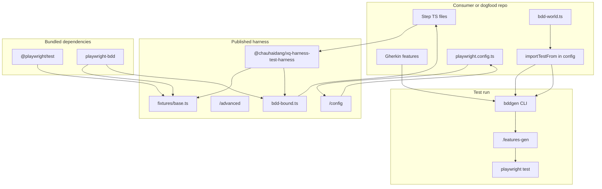

# `@chauhaidang/xq-harness-test-harness`

Project overview and architecture for the XQ **Playwright API + Gherkin BDD** harness. The package wraps [`playwright-bdd`](https://github.com/vitalets/playwright-bdd) and [`@playwright/test`](https://playwright.dev) so backend black-box tests can use a single Yarn dependency, pre-bound step keywords, and a shared Playwright config helper.

**Using the harness in another repo?** See [docs/CONSUMER-GUIDE.md](docs/CONSUMER-GUIDE.md) and the agent skill [skills/xq-harness-test-harness-bdd/SKILL.md](skills/xq-harness-test-harness-bdd/SKILL.md) (install, VS Code, CI, scripts).

---

## Goals

| Goal | How the harness addresses it |
|------|------------------------------|
| **API-first backend tests** | No browser channel by default; `request` is Playwright’s native fixture; `use.baseURL` in config drives relative URLs. |
| **Gherkin without ceremony** | **Tier A:** one `test`, pre-bound `Given` / `When` / `Then` / `Step`; consumers do not call `createBdd` in normal flows. |
| **Single consumer dependency** | `@playwright/test` and `playwright-bdd` are **bundled** as runtime `dependencies` (not peers). |
| **Room for XQ-specific context** | Reserved **`xq`** fixture (`XQFixture`) with logging and placeholder infra buckets; **`xq.apis`** is an empty shell typed via mergeable **`XQApiClients`** (consumers augment types and merge runtime clients in **`bdd-world.ts`**). |
| **Escape hatch** | `./advanced` exports `mergeTests` and `createHarnessBdd` for custom `test.extend` / merged fixtures. |

**Out of scope (today):** shipping generated OpenAPI clients, browser UI tests, or Python/Java harnesses (separate packages later).

---

## Architecture (high level)



**Execution path**

1. Consumer **`playwright.config.ts`** calls **`defineApiHarnessConfig`** (`/config`) → registers a **bdd** project (via `defineBddProject`) and optional **contract** project.
2. Consumer **`bdd-world.ts`** re-exports harness **`test`** / **`expect`**; **`playwright.config.ts`** sets **`bdd.importTestFrom: './bdd-world.ts'`** so **bddgen** generated specs use the same **`test`** as your steps.
3. **`playwright test`** runs generated specs under `.features-gen` plus any plain Playwright specs in the **contract** project.

---

## Package layout

```text
packages/xq-harness-test-harness/
├── src/                          # Published library (tsc → dist/)
│   ├── fixtures/base.ts          # Canonical test + xq fixture
│   ├── bdd-bound.ts              # createBdd(test) once → Tier A keywords
│   ├── index.ts                  # Entry "." 
│   ├── config.ts                 # defineApiHarnessConfig, merge helper
│   └── advanced.ts               # mergeTests, createHarnessBdd
├── dist/                         # Build output (gitignored; npm "files")
├── bdd-dogfood/                  # In-package BDD examples
├── playwright.config.ts          # Dogfood + contract projects
├── tests/                        # Contract tests (config merge)
├── scripts/mock-http-server.mjs  # Dogfood webServer target
├── docs/CONSUMER-GUIDE.md        # External consumer setup
├── skills/xq-harness-test-harness-bdd/   # Agent-oriented setup checklist
├── TEST-PLAN.md                  # Manual / regression tiers
└── CHANGELOG.md
```

Monorepo sibling: **`packages/xq-harness-test-harness-e2e-consumer/`** (private) depends only on `workspace:*` harness and proves the single-dependency consumer story (mock on a different port than dogfood).

---

## Source modules

### `src/fixtures/base.ts`

- Extends **`playwright-bdd`’s `test`** (required so `createBdd` binds to the bdd runtime, not raw `@playwright/test`).
- Adds **`xq: XQFixture`** — shared context with **`apis: {}`** at runtime until the consumer merges clients; **`XQApiClients`** is an empty mergeable **`interface`** for consumer augmentation (see [docs/CONSUMER-GUIDE.md](docs/CONSUMER-GUIDE.md)).
- Consumers must align augmentation with **`test.extend`** on **`xq.apis`**; the harness does not ship SDK instances.
- Re-exports **`expect`** from `@playwright/test`.
- Does **not** override **`request`**; consumers set **`use.baseURL`** in config (e.g. from `process.env.BASE_URL`).

### `src/bdd-bound.ts`

- Calls **`createBdd(test)`** once against the canonical `test` from `base.ts`.
- Re-exports **`Given`**, **`When`**, **`Then`**, **`Step`** for Tier A (playwright-bdd v8 has no separate `And` / `But` builders; Gherkin `And`/`But` in `.feature` files still work).

### `src/index.ts` (export `"."`)

- **`test`**, **`expect`**, Tier A BDD exports, types **`XQFixture`** and **`XQApiClients`**.
- Does **not** export `mergeTests` or raw `createBdd`.

### `src/config.ts` (export `"./config"`)

- **`mergeApiHarnessPlaywrightConfig`** — pure merge (used by contract tests and `defineApiHarnessConfig`).
- **`defineApiHarnessConfig`** — `defineConfig` wrapper.
- **`defineBddProject`** — re-export from `playwright-bdd`.
**Project merge order:** optional **bdd** project → optional **contract** project (when `contractSpecs` set) → `options.projects` → `overrides.projects`. **`use`** is shallow-merged; **`overrides.use`** layers on top.

### `src/advanced.ts` (export `"./advanced"`)

- **`mergeTests`**, **`createHarnessBdd`** escape hatch (not required for the default **`xq.apis`** flow in [docs/CONSUMER-GUIDE.md](docs/CONSUMER-GUIDE.md)).

---

## Design decisions

| Topic | Decision |
|--------|----------|
| **Tier A** | Single canonical `test`; pre-bound BDD keywords; no consumer `createBdd` in normal flows. |
| **Dependencies** | Bundle `@playwright/test` + `playwright-bdd`; consumers install **only** this package for the stack. |
| **`importTestFrom`** | Consumer sets **`bdd.importTestFrom`** to **`./bdd-world.ts`** (or a custom merged `test` module). |
| **`request`** | Native Playwright fixture; configure via **`use.baseURL`** in `defineApiHarnessConfig`. |
| **`xq` / `XQApiClients`** | Empty `xq.apis` + mergeable interface; consumers augment types and merge matching instances in `bdd-world.ts`. |
| **Gherkin And/But** | In features only; step files use `Given`/`When`/`Then`/`Step`. |

---

## Public API (summary)

| Subpath | Role |
|---------|------|
| `@chauhaidang/xq-harness-test-harness` | `test`, `expect`, `Given`, `When`, `Then`, `Step`, `XQFixture`, `XQApiClients` |
| `@chauhaidang/xq-harness-test-harness/config` | `defineApiHarnessConfig`, `mergeApiHarnessPlaywrightConfig`, `defineBddProject` |
| `@chauhaidang/xq-harness-test-harness/advanced` | `mergeTests`, `createHarnessBdd` |

Build: **`yarn build`** (`tsc` → `dist/`). Published **`files`**: `dist`, `README.md`, `CHANGELOG.md`, `LICENSE`, `docs`, `skills`.

---

## Validation in xq-toolbox

| Layer | Location | Purpose |
|-------|----------|---------|
| **Contract** | `tests/*.contract.spec.ts` | Config merge behavior without full BDD run |
| **Dogfood** | `bdd-dogfood/` + `playwright.config.ts` | Tier A steps against mock HTTP (port **19999**) |
| **E2E consumer** | `packages/xq-harness-test-harness-e2e-consumer/` | External-style layout; only `workspace:*` harness dep (port **19998**) |

From repo root: `task build:xq-test-harness`, `task test:xq-test-harness`, `task test:xq-test-harness-e2e-consumer`, `task lint:xq-test-harness`.

---

## Publishing

Bump **`version`** in `package.json` on `main`; CI [`scripts/check-version-changes.js`](../../scripts/check-version-changes.js) publishes changed workspaces to GitHub Packages. See [`.github/workflows/publish.yml`](../../.github/workflows/publish.yml). API-only CI can set **`PLAYWRIGHT_SKIP_BROWSER_DOWNLOAD=1`** on install.

---

## Related documentation

| Document | Audience |
|----------|----------|
| [docs/CONSUMER-GUIDE.md](docs/CONSUMER-GUIDE.md) | Teams adopting the harness (`bdd-world.ts`, `XQApiClients`, `xq.apis`) |
| [skills/xq-harness-test-harness-bdd/SKILL.md](skills/xq-harness-test-harness-bdd/SKILL.md) | Agents (full setup: registry → VS Code → CI) |
| [TEST-PLAN.md](TEST-PLAN.md) | QA / regression tiers |
| [CHANGELOG.md](CHANGELOG.md) | Release notes |
